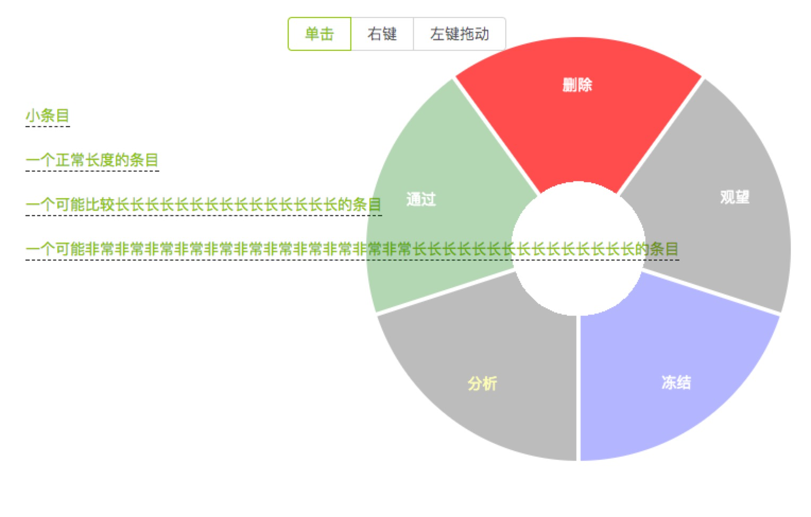

# pieMenu
A configured pie menu powered by React. Part of jihuatong


[demo](http://piemenu.keepsolo.com/)
# Start
```shell
 npm install
 npm run dev
```
or open /public/index.html

Then update state.options in /src/component/PieMenu

If you like it,please
# Star me